# GR Framework v2.0 - Entity Relationship Diagram

**버전**: v2.0
**최종 수정**: 2025-11-20
**목적**: 데이터베이스 스키마 시각화

---

## 1. ER Diagram Overview

### 1.1 Core Entity Groups

1. **Dimension Tables** (차원 테이블)
   - layers, zones, domains, tags

2. **Component Tables** (구성요소 테이블)
   - components, component_tags, tech_stack_components

3. **Vulnerability Tables** (취약점 테이블)
   - cve, cve_tech_stack_mapping, cve_component_mapping

4. **Staging Tables** (배치 처리용 - NEW)
   - staging_cve, staging_mitre_techniques, batch_processing_jobs, crawling_schedule

5. **MITRE ATT&CK Tables**
   - mitre_tactics, mitre_techniques, mitre_cve_mapping, mitre_tag_mapping, mitre_tech_stack_mapping

6. **Interface & Security Tables**
   - interface_mappings, security_controls, compliance_mappings

7. **Audit Tables**
   - audit_log, vulnerability_assessments

---

## 2. Mermaid ER Diagram

### 2.1 Core Relationships

```mermaid
erDiagram
    %% Dimension Tables
    layers ||--o{ components : "located in"
    zones ||--o{ components : "deployed to"
    domains ||--o{ tags : "contains"
    tags ||--o{ tags : "parent-child"

    %% Component Relationships
    components ||--o{ component_tags : "has"
    tags ||--o{ component_tags : "applied to"
    components ||--o{ tech_stack_components : "uses"
    tags ||--o{ tech_stack_components : "categorized by"

    %% CVE Relationships
    cve ||--o{ cve_tech_stack_mapping : "affects"
    tech_stack_components ||--o{ cve_tech_stack_mapping : "vulnerable"
    cve ||--o{ cve_component_mapping : "impacts"
    components ||--o{ cve_component_mapping : "affected by"

    %% Staging & Batch Processing Relationships
    staging_cve ||--o{ batch_processing_jobs : "processed by"
    staging_mitre_techniques ||--o{ batch_processing_jobs : "processed by"
    crawling_schedule ||--o{ batch_processing_jobs : "schedules"

    %% MITRE ATT&CK Relationships
    mitre_tactics ||--o{ mitre_techniques : "contains"
    mitre_techniques ||--o{ mitre_techniques : "parent-child"
    mitre_techniques ||--o{ mitre_cve_mapping : "exploits"
    cve ||--o{ mitre_cve_mapping : "exploited by"
    mitre_techniques ||--o{ mitre_tag_mapping : "detected/mitigated by"
    tags ||--o{ mitre_tag_mapping : "detects/mitigates"
    mitre_techniques ||--o{ mitre_tech_stack_mapping : "targets"
    tags ||--o{ mitre_tech_stack_mapping : "tech stack"

    %% Interface & Security
    components ||--o{ interface_mappings : "source"
    components ||--o{ interface_mappings : "target"
    tags ||--o{ interface_mappings : "protocol"
    components ||--o{ security_controls : "protected by"
    tags ||--o{ security_controls : "control type"
    components ||--o{ compliance_mappings : "compliant"
    tags ||--o{ compliance_mappings : "compliance type"

    layers {
        varchar id PK
        varchar name
        decimal trust_level
        int position
    }

    zones {
        varchar id PK
        varchar name
        decimal trust_level
        boolean allow_internet
    }

    domains {
        varchar id PK
        varchar name
        varchar domain_type
    }

    tags {
        varchar id PK
        varchar domain_id FK
        varchar name
        varchar parent_tag_id FK
    }

    components {
        serial id PK
        varchar name
        varchar layer_id FK
        varchar zone_id FK
        varchar primary_tag_id FK
    }

    component_tags {
        serial id PK
        int component_id FK
        varchar tag_id FK
        boolean is_primary
    }

    tech_stack_components {
        serial id PK
        varchar tech_stack_tag FK
        varchar name
        varchar version
        int component_id FK
        varchar layer_id FK
        varchar zone_id FK
    }

    cve {
        serial id PK
        varchar cve_id UK
        decimal cvss_v3_score
        varchar severity
        date published_date
        varchar import_status
        varchar data_source
    }

    staging_cve {
        serial id PK
        varchar cve_id
        jsonb raw_data
        varchar data_source
        varchar status
        timestamp crawled_at
    }

    staging_mitre_techniques {
        serial id PK
        varchar technique_id
        varchar tactic_id
        jsonb raw_data
        varchar status
    }

    batch_processing_jobs {
        serial id PK
        varchar job_type
        varchar status
        timestamp scheduled_time
        int inserted_records
    }

    crawling_schedule {
        serial id PK
        varchar source
        varchar schedule_cron
        boolean is_enabled
        timestamp next_crawl_at
    }

    cve_tech_stack_mapping {
        serial id PK
        varchar cve_id FK
        varchar tech_stack_tag FK
        int tech_stack_component_id FK
        varchar affected_versions
        varchar fixed_version
    }

    cve_component_mapping {
        serial id PK
        varchar cve_id FK
        int component_id FK
        varchar remediation_status
        date remediation_deadline
    }

    mitre_tactics {
        varchar id PK
        varchar name
    }

    mitre_techniques {
        varchar id PK
        varchar tactic_id FK
        varchar name
        varchar parent_technique_id FK
    }

    mitre_cve_mapping {
        serial id PK
        varchar technique_id FK
        varchar cve_id FK
    }

    mitre_tag_mapping {
        serial id PK
        varchar technique_id FK
        varchar tag_id FK
        varchar mapping_type
    }

    mitre_tech_stack_mapping {
        serial id PK
        varchar technique_id FK
        varchar tech_stack_tag FK
        text attack_vector
    }

    interface_mappings {
        serial id PK
        varchar interface_tag FK
        varchar protocol
        int source_component_id FK
        int target_component_id FK
    }

    security_controls {
        serial id PK
        varchar control_tag FK
        int component_id FK
        varchar implementation_status
    }

    compliance_mappings {
        serial id PK
        varchar compliance_tag FK
        varchar framework
        int component_id FK
        varchar compliance_status
    }
```



---

## 3. Key Relationships

### 3.1 Dimension Hierarchy

```
domains (M, N, S, A, D, R, C, P, T, I)
  ↓
tags (M1, M1.1, M1.2, N1.2, S2.2.3, T2.1, I1.1, ...)
  ↓
components (NGINX ALB, PostgreSQL User DB, User Service, ...)
  ↓
tech_stack_components (NGINX 1.25.0, PostgreSQL 15.4, FastAPI 0.104.0, ...)
```

### 3.2 CVE Mapping Flow

```
CVE (CVE-2024-67890)
  ↓
cve_tech_stack_mapping (T2.1: PostgreSQL 14.0-14.9 → 14.10)
  ↓
tech_stack_components (PostgreSQL 14.10)
  ↓
components (PostgreSQL Order DB)
  ↓
Layer (L3) + Zone (Zone 3)
```

### 3.3 MITRE ATT&CK Integration

```
mitre_tactics (TA0001: Initial Access)
  ↓
mitre_techniques (T1190: Exploit Public-Facing Application)
  ↓
mitre_cve_mapping (T1190 → CVE-2024-67890)
  ↓
CVE → Tech Stack → Components → Layer/Zone

AND

mitre_techniques (T1190)
  ↓
mitre_tag_mapping (Detection: S1.1 WAF, M6.1 SIEM | Mitigation: S7.2 DAST)
```

### 3.4 Interface Communication Flow

```
source_component (React SPA, L5, Zone 5)
  ↓ interface_tag (I1.1: HTTPS/REST/JSON)
  ↓ encryption_tag (S3.1: TLS 1.3)
  ↓ auth_tag (I4.1: OAuth 2.0)
  ↓
target_component (Kong API Gateway, L1, Zone 1)
  ↓ interface_tag (I1.1: HTTP/REST)
  ↓ auth_tag (S2.2.3: JWT)
  ↓
target_component (User Service, L2, Zone 2)
```

### 3.5 Batch Processing Workflow (NEW)

```
External Sources (NVD, GitHub, MITRE)
  ↓ Crawling (Scheduled via crawling_schedule)
staging_cve / staging_mitre_techniques
  ↓ Review Process
  ↓ status: pending → reviewed → approved
batch_processing_jobs (Scheduled: Daily 02:00 AM)
  ↓ Import Process
  ↓ staging → production
cve / mitre_techniques
  ↓ Auto-mapping
cve_tech_stack_mapping, cve_component_mapping
  ↓ Impact Assessment
Components (Layer/Zone)
```

**Workflow States**:
```
staging_cve.status:
  pending → reviewed → approved → imported
  pending → reviewed → rejected

batch_processing_jobs.status:
  pending → running → completed
  pending → running → failed
```

---

## 4. Table Cardinalities

| Relationship | Cardinality | Description |
|-------------|-------------|-------------|
| layers → components | 1:N | Each component in one layer |
| zones → components | 1:N | Each component in one zone |
| domains → tags | 1:N | Each domain has multiple tags |
| tags → tags | 1:N | Hierarchical tags (parent-child) |
| components → component_tags | 1:N | Each component has multiple tags |
| tags → component_tags | 1:N | Each tag applies to multiple components |
| components → tech_stack_components | 1:N | Each component uses multiple tech stacks |
| cve → cve_tech_stack_mapping | 1:N | Each CVE affects multiple tech stacks |
| cve → cve_component_mapping | 1:N | Each CVE impacts multiple components |
| mitre_tactics → mitre_techniques | 1:N | Each tactic has multiple techniques |
| mitre_techniques → mitre_techniques | 1:N | Parent-child sub-techniques |
| mitre_techniques → mitre_cve_mapping | N:M | Techniques exploit multiple CVEs |
| mitre_techniques → mitre_tag_mapping | N:M | Techniques detected/mitigated by tags |
| components → interface_mappings | 1:N (source) | Each component can be source of multiple interfaces |
| components → interface_mappings | 1:N (target) | Each component can be target of multiple interfaces |
| components → security_controls | 1:N | Each component has multiple security controls |
| components → compliance_mappings | 1:N | Each component has multiple compliance requirements |
| staging_cve → batch_processing_jobs | N:1 | Multiple staging records processed by one job |
| staging_mitre_techniques → batch_processing_jobs | N:1 | Multiple staging records processed by one job |
| crawling_schedule → batch_processing_jobs | 1:N | Each schedule triggers multiple jobs over time |

---

## 5. Query Examples

### 5.1 Find all CVEs affecting a specific component

```sql
SELECT
    c.cve_id,
    c.cvss_v3_score,
    c.severity,
    comp.name AS component_name,
    ccm.remediation_status,
    ccm.remediation_deadline
FROM cve c
JOIN cve_component_mapping ccm ON c.cve_id = ccm.cve_id
JOIN components comp ON ccm.component_id = comp.id
WHERE comp.name = 'PostgreSQL Order DB'
ORDER BY c.cvss_v3_score DESC;
```

### 5.2 Find all components affected by a CVE

```sql
SELECT
    comp.name,
    comp.layer_id,
    comp.zone_id,
    ts.name || ' ' || ts.version AS tech_stack,
    ctsm.affected_versions,
    ctsm.fixed_version
FROM cve_tech_stack_mapping ctsm
JOIN tech_stack_components ts ON ctsm.tech_stack_component_id = ts.id
JOIN components comp ON ts.component_id = comp.id
WHERE ctsm.cve_id = 'CVE-2024-67890';
```

### 5.3 Find MITRE ATT&CK techniques with detection/mitigation tags

```sql
SELECT
    mt.id AS technique_id,
    mt.name AS technique_name,
    mtm.mapping_type,
    t.id AS tag_id,
    t.name AS tag_name,
    mtm.detection_method,
    mtm.mitigation_method
FROM mitre_techniques mt
JOIN mitre_tag_mapping mtm ON mt.id = mtm.technique_id
JOIN tags t ON mtm.tag_id = t.id
WHERE mt.id = 'T1190'
ORDER BY mtm.mapping_type, t.id;
```

### 5.4 Find communication flow for a component

```sql
SELECT
    source.name AS source_component,
    im.protocol,
    im.format,
    target.name AS target_component,
    enc_tag.name AS encryption,
    auth_tag.name AS authentication,
    im.source_layer || ' → ' || im.target_layer AS layer_flow,
    im.source_zone || ' → ' || im.target_zone AS zone_flow
FROM interface_mappings im
JOIN components source ON im.source_component_id = source.id
JOIN components target ON im.target_component_id = target.id
LEFT JOIN tags enc_tag ON im.encryption_tag = enc_tag.id
LEFT JOIN tags auth_tag ON im.auth_tag = auth_tag.id
WHERE source.name = 'React SPA' OR target.name = 'React SPA'
ORDER BY im.id;
```

### 5.5 Monitor staging and batch processing status (NEW)

```sql
-- Staging CVE status summary
SELECT
    status,
    data_source,
    COUNT(*) AS count,
    MIN(crawled_at) AS oldest_crawl,
    MAX(crawled_at) AS newest_crawl
FROM staging_cve
GROUP BY status, data_source
ORDER BY data_source, status;

-- Batch job success rate (last 30 days)
SELECT
    job_type,
    COUNT(*) AS total_jobs,
    SUM(CASE WHEN status = 'completed' THEN 1 ELSE 0 END) AS successful,
    SUM(CASE WHEN status = 'failed' THEN 1 ELSE 0 END) AS failed,
    ROUND(100.0 * SUM(CASE WHEN status = 'completed' THEN 1 ELSE 0 END) / COUNT(*), 2) AS success_rate,
    AVG(inserted_records) AS avg_inserted_records
FROM batch_processing_jobs
WHERE started_at >= NOW() - INTERVAL '30 days'
GROUP BY job_type;

-- Next scheduled crawls
SELECT
    source,
    crawl_type,
    is_enabled,
    last_crawl_at,
    next_crawl_at,
    EXTRACT(EPOCH FROM (next_crawl_at - NOW())) / 3600 AS hours_until_next
FROM crawling_schedule
WHERE is_enabled = TRUE
ORDER BY next_crawl_at;
```

---

## 6. Index Strategy

### 6.1 High-Frequency Queries

```sql
-- CVE searches (by severity, score, tech stack)
CREATE INDEX idx_cve_severity ON cve(severity);
CREATE INDEX idx_cve_score ON cve(cvss_v3_score DESC);
CREATE INDEX idx_cve_tech_stack_tag ON cve_tech_stack_mapping(tech_stack_tag);

-- Component lookups (by layer, zone, tag)
CREATE INDEX idx_components_layer_zone ON components(layer_id, zone_id);
CREATE INDEX idx_components_primary_tag ON components(primary_tag_id);

-- MITRE ATT&CK lookups
CREATE INDEX idx_mitre_techniques_tactic ON mitre_techniques(tactic_id);
CREATE INDEX idx_mitre_tag_technique ON mitre_tag_mapping(technique_id);

-- Interface and communication flow
CREATE INDEX idx_interface_source ON interface_mappings(source_component_id);
CREATE INDEX idx_interface_target ON interface_mappings(target_component_id);

-- Staging and batch processing (NEW)
CREATE INDEX idx_staging_cve_status ON staging_cve(status);
CREATE INDEX idx_staging_cve_source ON staging_cve(data_source);
CREATE INDEX idx_staging_cve_crawled ON staging_cve(crawled_at DESC);
CREATE INDEX idx_batch_jobs_type ON batch_processing_jobs(job_type);
CREATE INDEX idx_batch_jobs_status ON batch_processing_jobs(status);
CREATE INDEX idx_crawling_schedule_enabled ON crawling_schedule(is_enabled);
CREATE INDEX idx_crawling_schedule_next ON crawling_schedule(next_crawl_at);
```

### 6.2 Join Optimization

```sql
-- Component-Tag joins (most frequent)
CREATE INDEX idx_component_tags_component ON component_tags(component_id);
CREATE INDEX idx_component_tags_tag ON component_tags(tag_id);

-- Tech Stack joins
CREATE INDEX idx_tech_stack_component ON tech_stack_components(component_id);
CREATE INDEX idx_cve_tech_stack_component ON cve_tech_stack_mapping(tech_stack_component_id);
```

---

## 7. STIX Export Mapping

**User's Decision**: Database stores atomized relational format, converts to STIX on-demand or in batch.

### 7.1 STIX Object Mapping

```yaml
CVE → STIX Vulnerability Object:
  type: vulnerability
  spec_version: 2.1
  id: vulnerability--<uuid>
  name: CVE-2024-67890
  description: SQL Injection vulnerability...
  external_references:
    - source_name: cve
      external_id: CVE-2024-67890
  x_cvss_score: 9.8
  x_severity: Critical

MITRE Technique → STIX Attack-Pattern Object:
  type: attack-pattern
  spec_version: 2.1
  id: attack-pattern--<uuid>
  name: Exploit Public-Facing Application
  external_references:
    - source_name: mitre-attack
      external_id: T1190

Component → STIX Identity/Infrastructure Object:
  type: infrastructure
  spec_version: 2.1
  id: infrastructure--<uuid>
  name: PostgreSQL Order DB
  infrastructure_types: [database]
  x_layer: L3
  x_zone: Zone 3
  x_tags: [D1.1, T2.1, S3.2]

Relationship → STIX Relationship Object:
  type: relationship
  spec_version: 2.1
  source_ref: vulnerability--<cve-uuid>
  target_ref: infrastructure--<component-uuid>
  relationship_type: targets
```

### 7.2 Batch Export Query

```sql
-- Export all CVEs to STIX format
SELECT
    'vulnerability' AS type,
    '2.1' AS spec_version,
    'vulnerability--' || gen_random_uuid() AS id,
    cve_id AS name,
    description,
    jsonb_build_object(
        'source_name', 'cve',
        'external_id', cve_id
    ) AS external_references,
    cvss_v3_score AS x_cvss_score,
    severity AS x_severity
FROM cve
WHERE published_date > CURRENT_DATE - INTERVAL '30 days';
```

---

## 8. Next Steps

- **Performance Testing**: Load test with 10,000+ CVEs, 1,000+ components
- **STIX Export Script**: Python script for batch STIX conversion
- **Monitoring Dashboard**: Grafana dashboard for CVE tracking
- **API Development**: REST API for vulnerability queries

---

**문서 종료**
