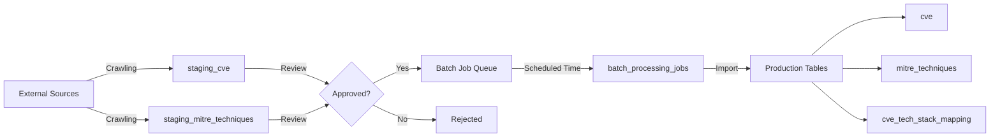

# GR Framework v2.0 - Batch Processing Workflow

**버전**: v2.0
**최종 수정**: 2025-11-20
**목적**: 배치 처리 기반 취약점 데이터 등록 워크플로우

---

## 1. Overview

### 1.1 설계 철학

**핵심 원칙**: 크롤링과 DB 등록을 분리하여 데이터 품질 보장

```
기존 (실시간 방식):
  크롤링 → 즉시 DB 등록 → 품질 문제 발생 가능

신규 (배치 방식):
  크롤링 → Staging → 검토 → 승인 → 예약된 시간에 DB 등록
```

### 1.2 주요 특징

1. **지속적 크롤링**: 24시간 크롤링 가능
2. **스테이징 영역**: 크롤링된 데이터 임시 저장
3. **수동 검토**: 승인/거부 프로세스
4. **예약 등록**: 정해진 시간에 배치 처리
5. **추적성**: 모든 단계 로그 기록

---

## 2. 데이터 흐름

### 2.1 전체 워크플로우



### 2.2 상세 프로세스

#### Phase 1: 크롤링 (Continuous)
```yaml
Sources:
  - NVD (National Vulnerability Database)
  - GitHub Security Advisory
  - MITRE ATT&CK
  - OSV (Open Source Vulnerabilities)

Frequency:
  - NVD: 매 6시간
  - GitHub: 매 12시간
  - MITRE: 매일
  - OSV: 매 12시간

Target Tables:
  - staging_cve
  - staging_mitre_techniques
```

#### Phase 2: 검토 (Manual/Automated)
```yaml
Review Process:
  1. 자동 검증:
     - JSON 스키마 유효성
     - CVE ID 형식 검증
     - 중복 체크
     - 필수 필드 존재 확인

  2. 수동 검토:
     - 데이터 정확성 확인
     - 기존 데이터와 충돌 확인
     - 비즈니스 규칙 적용

  3. 상태 변경:
     - pending → reviewed → approved
     - pending → reviewed → rejected
```

#### Phase 3: 배치 처리 (Scheduled)
```yaml
Batch Schedule:
  - Daily Import: 매일 02:00 AM
  - Weekly Cleanup: 매주 일요일 03:00 AM
  - Monthly Archive: 매월 1일 04:00 AM

Batch Jobs:
  1. CVE Import Job:
     - staging_cve (approved) → cve
     - 자동으로 tech_stack 매핑
     - 영향받는 component 식별

  2. MITRE Import Job:
     - staging_mitre_techniques → mitre_techniques
     - CVE와 자동 매핑
     - Tag 기반 detection/mitigation 설정

  3. Cleanup Job:
     - imported 데이터 archived로 변경
     - 30일 이상 rejected 데이터 삭제
```

---

## 3. 테이블 구조

### 3.1 Staging Tables

#### staging_cve
```sql
Purpose: 크롤링된 CVE 데이터 임시 저장

Key Fields:
  - raw_data (JSONB): 크롤링된 원본 JSON
  - status: pending, reviewed, approved, rejected, imported
  - reviewed_by: 검토자
  - imported_to_production: 프로덕션 반영 여부

Workflow:
  pending → reviewed → approved → imported
  pending → reviewed → rejected
```

#### staging_mitre_techniques
```sql
Purpose: 크롤링된 MITRE ATT&CK 데이터 임시 저장

Key Fields:
  - technique_id: T1190, T1078, ...
  - tactic_id: TA0001, TA0002, ...
  - raw_data (JSONB): 원본 JSON
  - status: pending → approved → imported

Workflow:
  Same as staging_cve
```

#### batch_processing_jobs
```sql
Purpose: 배치 작업 실행 추적

Key Fields:
  - job_type: cve_import, mitre_import, cleanup, ...
  - status: pending, running, completed, failed
  - metrics: total_records, inserted, updated, failed
  - error_log: 실패 원인 기록

Monitoring:
  - 작업 실행 시간 추적
  - 성공/실패율 모니터링
  - 성능 메트릭 수집
```

#### crawling_schedule
```sql
Purpose: 크롤링 스케줄 관리

Key Fields:
  - source: NVD, GitHub, MITRE, ...
  - schedule_cron: "0 2 * * *" (크론 표현식)
  - is_enabled: 활성화 여부
  - last_crawl_at, next_crawl_at: 시간 추적

Features:
  - 스케줄 활성화/비활성화
  - 마지막 작업 ID 추적
  - 다음 실행 시간 자동 계산
```

### 3.2 Production Tables (with Batch Fields)

#### cve (Updated)
```sql
New Fields:
  - import_status: active, staged, archived
  - data_source: NVD, GitHub Advisory, ...
  - imported_at: 실제 DB 등록 시간
  - imported_by: 등록한 사용자/시스템

Purpose:
  - 데이터 출처 추적
  - 배치 처리 이력 관리
  - 데이터 라이프사이클 관리
```

---

## 4. 사용 예시

### 4.1 크롤링 스케줄 설정

```sql
-- NVD 크롤링 스케줄 설정 (매 6시간)
INSERT INTO crawling_schedule
(source, crawl_type, schedule_cron, is_enabled, description)
VALUES
('NVD', 'cve', '0 */6 * * *', TRUE, 'NVD CVE 데이터 크롤링 (6시간마다)');

-- MITRE ATT&CK 크롤링 스케줄 설정 (매일 02:00)
INSERT INTO crawling_schedule
(source, crawl_type, schedule_cron, is_enabled, description)
VALUES
('MITRE ATT&CK', 'mitre_techniques', '0 2 * * *', TRUE, 'MITRE ATT&CK 기법 크롤링 (매일 02:00)');
```

### 4.2 크롤링 데이터 저장

```sql
-- 크롤링된 CVE 데이터 저장
INSERT INTO staging_cve
(cve_id, raw_data, data_source, status)
VALUES
('CVE-2024-12345',
 '{"id": "CVE-2024-12345", "description": "...", "cvss_v3": 9.8}'::jsonb,
 'NVD',
 'pending');
```

### 4.3 데이터 검토 및 승인

```sql
-- 자동 검증 (JSON 스키마, 중복 체크)
UPDATE staging_cve
SET status = 'reviewed',
    reviewed_by = 'auto-validator',
    reviewed_at = NOW()
WHERE status = 'pending'
  AND raw_data->>'id' IS NOT NULL
  AND raw_data->>'cvss_v3_score' IS NOT NULL;

-- 수동 승인
UPDATE staging_cve
SET status = 'approved',
    reviewed_by = 'admin@example.com',
    reviewed_at = NOW(),
    notes = 'Verified against NVD official data'
WHERE id = 123
  AND status = 'reviewed';

-- 거부
UPDATE staging_cve
SET status = 'rejected',
    reviewed_by = 'admin@example.com',
    reviewed_at = NOW(),
    rejection_reason = 'Duplicate CVE-2024-12345',
    notes = 'Already exists in production'
WHERE id = 124;
```

### 4.4 배치 작업 생성 및 실행

```sql
-- 배치 작업 생성
INSERT INTO batch_processing_jobs
(job_type, job_name, scheduled_time, total_records, executed_by)
SELECT
    'cve_import',
    'Daily CVE Import - 2025-11-20',
    '2025-11-20 02:00:00',
    COUNT(*),
    'batch-scheduler'
FROM staging_cve
WHERE status = 'approved'
  AND imported_to_production = FALSE;

-- 배치 작업 실행 시뮬레이션
BEGIN;

-- 1. 작업 상태 업데이트
UPDATE batch_processing_jobs
SET status = 'running',
    started_at = NOW()
WHERE id = 1;

-- 2. staging_cve → cve 데이터 이동
INSERT INTO cve
(cve_id, description, published_date, cvss_v3_score, severity,
 data_source, imported_at, imported_by, import_status)
SELECT
    raw_data->>'id',
    raw_data->>'description',
    (raw_data->>'published_date')::DATE,
    (raw_data->>'cvss_v3_score')::DECIMAL,
    raw_data->>'severity',
    data_source,
    NOW(),
    'batch-job-1',
    'active'
FROM staging_cve
WHERE status = 'approved'
  AND imported_to_production = FALSE;

-- 3. staging_cve 상태 업데이트
UPDATE staging_cve
SET imported_to_production = TRUE,
    imported_at = NOW(),
    status = 'imported'
WHERE status = 'approved'
  AND imported_to_production = FALSE;

-- 4. 작업 완료 상태 업데이트
UPDATE batch_processing_jobs
SET status = 'completed',
    completed_at = NOW(),
    inserted_records = (SELECT COUNT(*) FROM staging_cve WHERE status = 'imported'),
    processed_records = (SELECT COUNT(*) FROM staging_cve WHERE status = 'imported')
WHERE id = 1;

COMMIT;
```

### 4.5 모니터링 쿼리

```sql
-- 1. Staging 상태 요약
SELECT
    status,
    COUNT(*) AS count,
    MIN(crawled_at) AS oldest,
    MAX(crawled_at) AS newest
FROM staging_cve
GROUP BY status;

-- 2. 배치 작업 성공률
SELECT
    job_type,
    COUNT(*) AS total_jobs,
    SUM(CASE WHEN status = 'completed' THEN 1 ELSE 0 END) AS successful,
    ROUND(100.0 * SUM(CASE WHEN status = 'completed' THEN 1 ELSE 0 END) / COUNT(*), 2) AS success_rate,
    AVG(EXTRACT(EPOCH FROM (completed_at - started_at))) AS avg_duration_seconds
FROM batch_processing_jobs
WHERE started_at >= NOW() - INTERVAL '30 days'
GROUP BY job_type;

-- 3. 크롤링 스케줄 상태
SELECT
    source,
    crawl_type,
    schedule_cron,
    is_enabled,
    last_crawl_at,
    next_crawl_at,
    EXTRACT(EPOCH FROM (next_crawl_at - NOW())) / 3600 AS hours_until_next
FROM crawling_schedule
ORDER BY next_crawl_at;

-- 4. 승인 대기 중인 데이터
SELECT
    data_source,
    status,
    COUNT(*) AS count,
    MAX(crawled_at) AS latest_crawl
FROM staging_cve
WHERE status IN ('pending', 'reviewed')
GROUP BY data_source, status;
```

---

## 5. 운영 가이드

### 5.1 일일 운영 체크리스트

```yaml
매일 아침 (09:00):
  1. 배치 작업 결과 확인:
     - batch_processing_jobs (status = 'failed' 체크)
     - error_log 확인

  2. Staging 데이터 검토:
     - staging_cve (status = 'pending' 승인 대기)
     - 자동 검증 실패 케이스 수동 검토

  3. 크롤링 상태 확인:
     - crawling_schedule (last_crawl_at 확인)
     - 크롤링 실패 시 수동 재실행

매주 월요일 (10:00):
  1. 주간 통계 리포트:
     - 신규 CVE 등록 건수
     - 배치 작업 성공률
     - 평균 처리 시간

  2. Staging 데이터 정리:
     - imported 데이터 archived로 변경
     - rejected 데이터 30일 이상 삭제

매월 1일 (11:00):
  1. 월간 감사:
     - 모든 크롤링 소스 정상 작동 확인
     - 스케줄 최적화 (필요시 조정)
     - 데이터 품질 리포트
```

### 5.2 알림 설정

```yaml
Critical Alerts (즉시 알림):
  - 배치 작업 실패 (status = 'failed')
  - 크롤링 3회 연속 실패
  - DB 용량 90% 초과

Warning Alerts (1시간 내):
  - 승인 대기 데이터 100건 초과
  - 배치 작업 평균 실행 시간 2배 증가
  - Staging 테이블 용량 80% 초과

Info Alerts (일일 리포트):
  - 신규 CVE 등록 건수
  - 배치 작업 완료 통계
  - 데이터 소스별 크롤링 성공률
```

### 5.3 트러블슈팅

#### 문제 1: 배치 작업 실패
```sql
-- 1. 에러 로그 확인
SELECT id, job_type, error_log, started_at
FROM batch_processing_jobs
WHERE status = 'failed'
ORDER BY started_at DESC
LIMIT 10;

-- 2. 실패한 레코드 식별
-- (error_log에서 CVE ID 추출)

-- 3. Staging 데이터 재검증
SELECT id, cve_id, raw_data, status
FROM staging_cve
WHERE cve_id IN ('CVE-2024-xxxxx');

-- 4. 수동 수정 후 재실행
UPDATE staging_cve
SET status = 'approved',
    raw_data = jsonb_set(raw_data, '{cvss_v3_score}', '7.5')
WHERE id = 123;
```

#### 문제 2: 크롤링 실패
```sql
-- 1. 크롤링 스케줄 확인
SELECT *
FROM crawling_schedule
WHERE source = 'NVD'
  AND is_enabled = TRUE;

-- 2. 마지막 배치 작업 확인
SELECT *
FROM batch_processing_jobs
WHERE id = (SELECT last_job_id FROM crawling_schedule WHERE source = 'NVD');

-- 3. 스케줄 재활성화
UPDATE crawling_schedule
SET is_enabled = TRUE,
    next_crawl_at = NOW() + INTERVAL '1 hour'
WHERE source = 'NVD';
```

#### 문제 3: 중복 데이터
```sql
-- 1. 중복 CVE 식별
SELECT cve_id, COUNT(*)
FROM staging_cve
WHERE status = 'approved'
GROUP BY cve_id
HAVING COUNT(*) > 1;

-- 2. 최신 데이터만 유지
WITH ranked_cve AS (
    SELECT id, cve_id, crawled_at,
           ROW_NUMBER() OVER (PARTITION BY cve_id ORDER BY crawled_at DESC) AS rn
    FROM staging_cve
    WHERE status = 'approved'
)
UPDATE staging_cve
SET status = 'rejected',
    rejection_reason = 'Duplicate - newer version exists'
WHERE id IN (
    SELECT id FROM ranked_cve WHERE rn > 1
);
```

---

## 6. 성능 최적화

### 6.1 인덱스 전략

```sql
-- Staging 테이블 최적화
CREATE INDEX idx_staging_cve_status_crawled ON staging_cve(status, crawled_at DESC);
CREATE INDEX idx_staging_cve_approved ON staging_cve(imported_to_production)
WHERE status = 'approved';

-- 배치 작업 최적화
CREATE INDEX idx_batch_jobs_status_scheduled ON batch_processing_jobs(status, scheduled_time);
```

### 6.2 파티셔닝 (대용량 데이터)

```sql
-- staging_cve 파티셔닝 (월별)
CREATE TABLE staging_cve_y2025m11 PARTITION OF staging_cve
FOR VALUES FROM ('2025-11-01') TO ('2025-12-01');

CREATE TABLE staging_cve_y2025m12 PARTITION OF staging_cve
FOR VALUES FROM ('2025-12-01') TO ('2026-01-01');
```

### 6.3 배치 크기 최적화

```yaml
Small Batch (< 100 records):
  - 실시간에 가까운 처리
  - 트랜잭션 오버헤드 최소화

Medium Batch (100-1000 records):
  - 권장 배치 크기
  - 균형잡힌 성능과 신뢰성

Large Batch (> 1000 records):
  - 체크포인트 도입
  - 1000건마다 COMMIT
  - 실패 시 롤백 범위 제한
```

---

## 7. 보안 고려사항

### 7.1 접근 제어

```sql
-- 읽기 전용 사용자 (모니터링)
CREATE ROLE batch_monitor;
GRANT SELECT ON staging_cve, batch_processing_jobs, crawling_schedule TO batch_monitor;

-- 검토자 (승인/거부 권한)
CREATE ROLE batch_reviewer;
GRANT SELECT, UPDATE ON staging_cve, staging_mitre_techniques TO batch_reviewer;

-- 배치 실행자 (전체 권한)
CREATE ROLE batch_executor;
GRANT ALL ON ALL TABLES IN SCHEMA public TO batch_executor;
```

### 7.2 감사 로그

```sql
-- 모든 승인/거부 기록
CREATE TABLE staging_review_audit (
    id SERIAL PRIMARY KEY,
    staging_table VARCHAR(100),
    staging_id INT,
    old_status VARCHAR(50),
    new_status VARCHAR(50),
    reviewed_by VARCHAR(255),
    review_action VARCHAR(50),
    review_reason TEXT,
    timestamp TIMESTAMP DEFAULT NOW()
);

-- 트리거로 자동 기록
CREATE TRIGGER staging_cve_review_audit
AFTER UPDATE ON staging_cve
FOR EACH ROW
WHEN (OLD.status != NEW.status)
EXECUTE FUNCTION log_staging_review();
```

---

## 8. 다음 단계

1. **크롤러 개발**: Python/Node.js 크롤러 구현
2. **배치 스케줄러**: Celery, Airflow, or Cron 설정
3. **모니터링 대시보드**: Grafana 대시보드 구축
4. **알림 시스템**: Slack/Email 알림 통합
5. **API 개발**: REST API for staging approval workflow

---

**문서 종료**
